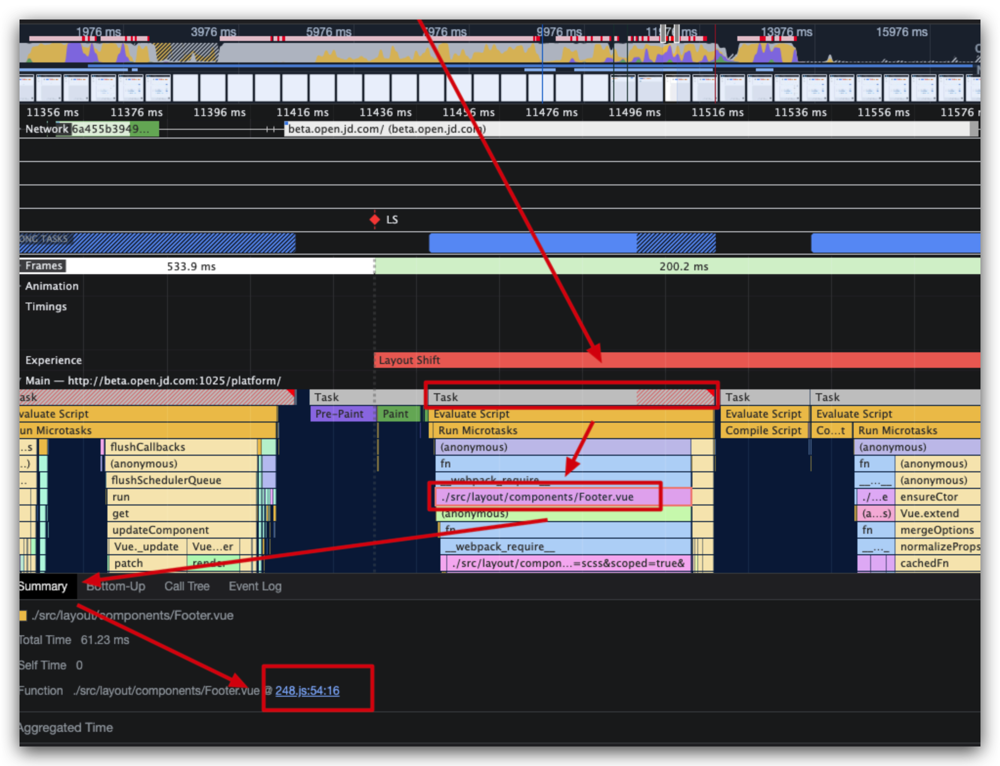
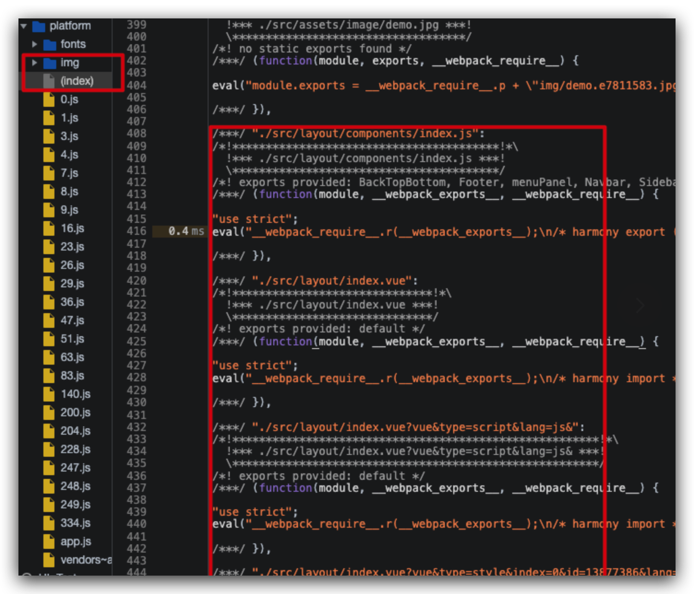
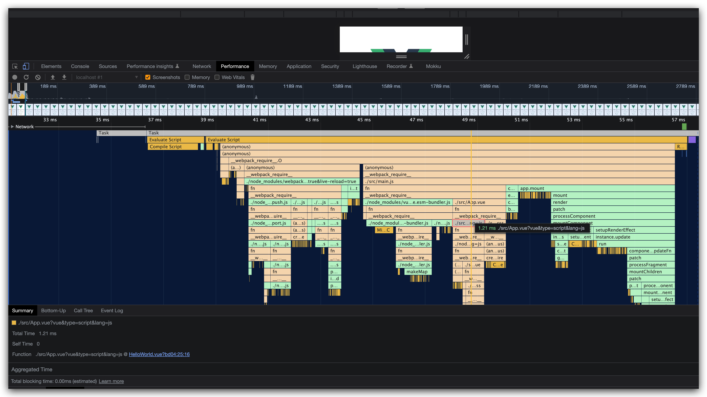

## Performance 无法跳转到源码

Chrome 106 中，在 console 中能够跳转到压缩后的代码，但是通过 Performance 面板的火焰图跳转到对应函数，则只能看到压缩后的代码。

## 原因

没有定位到具体的原因，推测可能和 Chrome 在 Performance 面板的 sourcemap 的支持有关，经测试在 Chrome Canary(版本 109.0.5366.0（正式版本）canary (arm64)) 版本中是可以正常跳转的。

前往 [https://www.google.com/chrome/canary/](https://www.google.com/chrome/canary/) 下载 Chrome Canary。